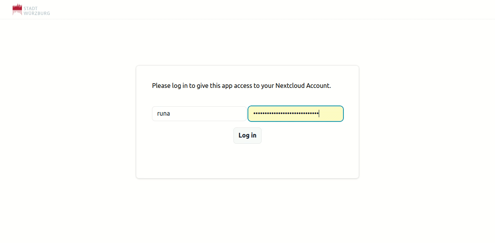

> [!IMPORTANT]  
> The project was moved to https://gitlab.opencode.de/wuerzburg/deck2gantt

# Nextcloud Deck Gantt

Simple web interface using FrappeGantt to show and edit Nextcloud Deck Board cards in gantt format

Thanks to [jeobz](https://github.com/jeobz/NxDeckGantt) for the original beta version.

Also thanks to: \
[Nextcloud Deck](https://github.com/nextcloud/deck) for the great Nextcloud app \
[Frappe](https://github.com/frappe/gantt) for the interactive javascript \
[Stadt Würzburg](https://www.wuerzburg.de/) for sponsoring \
[Tailwind CSS](https://tailwindcss.com/) \
[Alpine.js](https://alpinejs.dev/)

## How it looks



## How it works

Tasks with set due date in the nextcloud deck are shown in the gantt chart. Tasks without a set due date are shown in the list of unscheduled tasks.

Other information will be stored in the description of your cards in the nextcloud in the following form:

| Content of card description added | Gantt chart representation               | Can be set and initialized in Gantt | Has be initialized in Nextcloud | Can only be set in Nextcloud |
| --------------------------------- | ---------------------------------------- | ----------------------------------- | ------------------------------- | ---------------------------- |
| **d:8:d**                         | Duration in days                         | :white_check_mark:                  | :x:                             | :x:                          |
| **p:60:p**                        | Task/card progression in percent         | :x:                                 | :white_check_mark:              | :x:                          |
| **w:15,54,12:w**                  | comma separated ids of card dependencies | :x:                                 | :x:                             | :white_check_mark:           |

It is generally recommended - and in case you are using 2FA even necessary - to generate a device password, as you will not be able to log in with your uer credentials only. The process is described here: [Nextcloud User Documentation](https://docs.nextcloud.com/server/stable/user_manual/en/session_management.html)

## Installation

If you do not want to edit any styling, you can just copy the public folder and edit the NC_URL variable in the bundled file Scripts/main.js line 3176.

## Bundling

Before deploying the application to your servers you need to checkout the project and copy `private/conf.js.example` to `private/conf.js` and adapt the NC_URL variable to your needs in the form of `https://your.nextcloud.com`.
You can either do this on the server directly or do it locally and transfer the bundled files to your server later.

```
git clone https://github.com/ClaraRuna/NxDeckGantt.git
yarn install
# adapt nextcloud uri in configuration
yarn build #create files in public folder
```

Now, you need to place the files located in public folder on your server & configure your Server. 

If you are using Apache and for example copied the public folder to /var/www/NxDeckGantt/public it looks like this:

```
<VirtualHost *:80>
    ...
	DocumentRoot /var/www/NxDeckGantt
</VirtualHost>

<VirtualHost *:443>
    ...
	DocumentRoot /var/www/NxDeckGantt
</VirtualHost>

<Directory /var/www/NxDeckGantt>
	DirectoryIndex public/App.html
</Directory>
```

## Change logo

If you want to change the logo you have to replace the file public/logo.svg. If you change the name of the file, you also need to edit the name in public/App.html. You can do this independently of your bundling.
